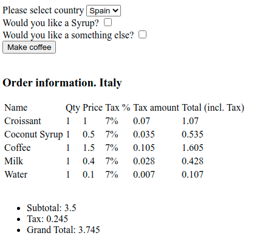

# HotCoffee v 0.0.1

This is a test task

## Install

Just run the command

`composer install`

**Don't worry, this is only needed to organize the autoloading of classes.**

## Description of the task
There are several coffee shops. In Spain and Italy. Special drink is Latte.
Though, there are different recipes of making Latte in different countries. Pricing policies differs from country to country as well.

Portion: double in Spain, single in Italy
Syrup: melon in Spain, coconut in Italy
Complement to Latte: 1 chocolate bar in Spain, krouasan in Italy

Cooking process is the same for both countries:
Boil the water
Pour water into a cup
Add coffee
Add milk
Add syrup
Add complement

Prices

Base price in Spain - 1 euro, in Italy - 1.5 euro
Milk in Spain - 0.3, in Italy 0.4
Syrup - 0.5 in both countries
Taxes - 3% per portion in Spain, 7% in Italy
Complement price - 1 euro in both countries

Your task

Make an HTML page, where user can choose a country, then add syrup or complement. And when user clicks to “Make coffee”, he sees all the ingredients and full price.

Use default PHP, without any frameworks.

## What could be improved/added
- To revise the technical approach in general
- It is necessary to save the user's selection on the frontend
- Here is need to add a currency class to format values
- Here is need to add container for messages (output messages on the web interface): error, notification, warning, etc.
- It is necessary to transfer the logic from the country class to the coffee maker
- The template engine needs to be improved
- Should we add the controller - MVC pattern?
